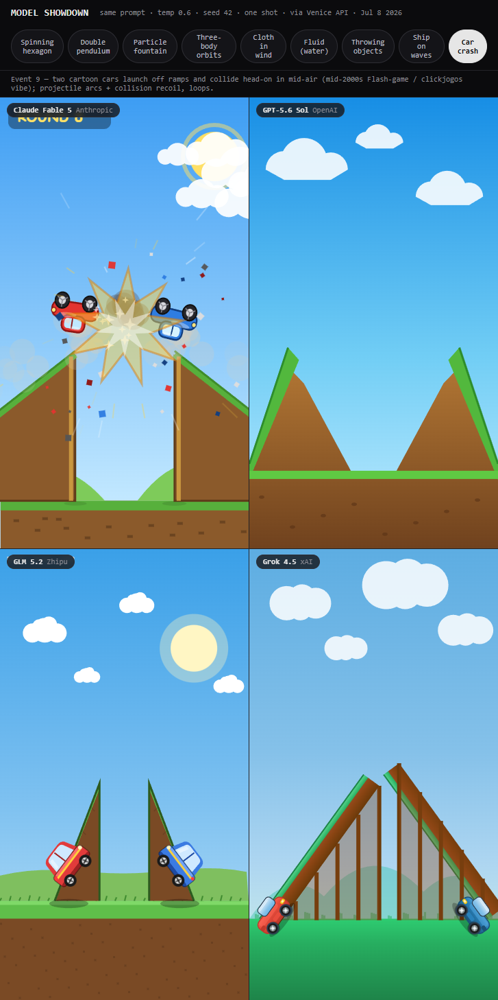
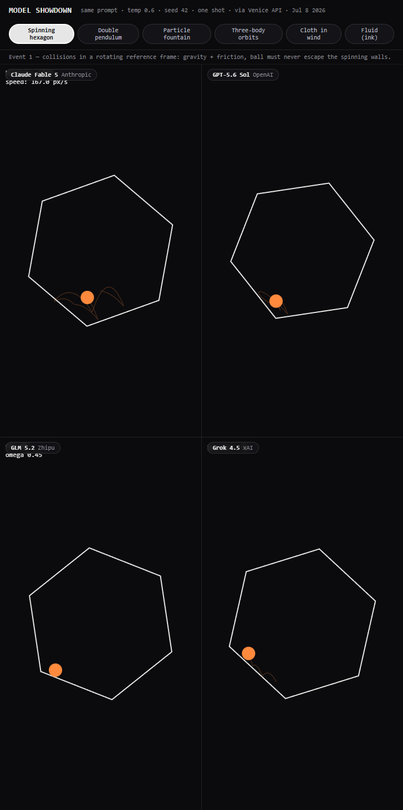
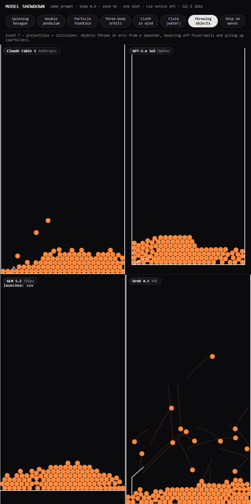
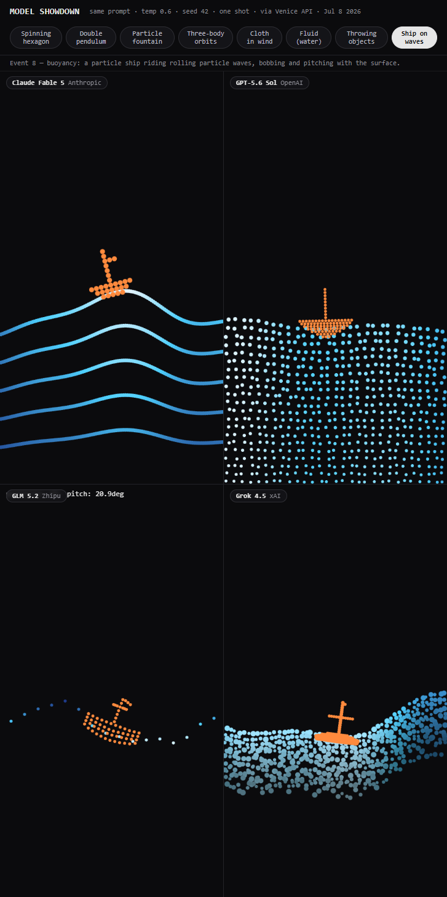
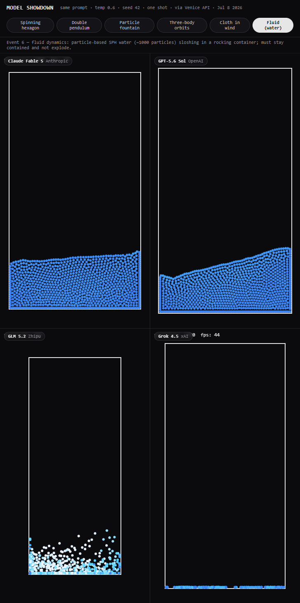

# Model Comparison — Physics Showdown

Same prompt, four frontier models, side by side.

Each model is asked — one-shot, with identical parameters — to write a self-contained physics simulation, and their outputs are rendered together in a 2×2 grid so you can watch all four run at the same time. Across **9 physics events**, only the physics differs between cells; the visual styling is pinned so the comparison is fair.

Every generation runs through the [Venice API](https://venice.ai).

## The models

| Cell | Model | Lab |
| --- | --- | --- |
| 1 | Claude Fable 5 | Anthropic |
| 2 | GPT-5.6 Sol | OpenAI |
| 3 | GLM 5.2 | Zhipu |
| 4 | Grok 4.5 | xAI |

## The events

Every model gets the **same prompt** (temperature 0.6, seed 42, one shot) with a shared visual spec, so differences come from the model — not the ask.

| Event | What it tests |
| --- | --- |
| Spinning hexagon | Collisions in a rotating reference frame (gravity, friction, containment) |
| Double pendulum | Chaotic dynamics + numerical integration stability |
| Particle fountain | Many-body simulation + rendering performance |
| Three-body orbits | Newtonian gravitation + energy/momentum conservation |
| Cloth in wind | Soft-body constraint solving (Verlet) |
| Fluid (water) | Particle-based SPH fluid, sloshing in a container |
| Throwing objects | Projectile motion + collisions + stacking |
| Ship on waves | Buoyancy + wave motion |
| Car crash | Two cartoon cars launch off ramps and collide head-on in mid-air — projectile arcs + collision recoil (mid-2000s Flash-game styling, clickjogos/ojogos) |

## Preview

### Car crash (mid-2000s Flash-game vibe)


### Spinning hexagon


### Throwing objects


### Ship on waves


### Fluid (water)


## Run it locally

The generated outputs are committed under `out/`, so you can view the whole showdown with **no API key required**:

```bash
npm start
# then open http://localhost:8613
```

`npm start` runs a tiny dependency-free static server (`server.mjs`) on port 8613. Click the tabs at the top to switch between events. Each cell is one model's actual one-shot output, rendered live in a sandboxed iframe.

## Regenerate (optional)

To re-run the models yourself, you need a [Venice API key](https://venice.ai). The generator reads it from the `VENICE_KEY` environment variable — it is never hard-coded.

```bash
# all events, all models
VENICE_KEY=your_key node run-showdown.mjs

# a single event
VENICE_KEY=your_key node run-showdown.mjs --task=hexagon

# one or more specific models (comma-separated)
VENICE_KEY=your_key node run-showdown.mjs --task=fluid --model=grok-4-5

# lower reasoning effort (faster; useful for heavy/slow runs)
VENICE_KEY=your_key node run-showdown.mjs --task=throwing --model=openai-gpt-56-sol --effort=low
```

On Windows PowerShell:

```powershell
$env:VENICE_KEY = 'your_key'; node run-showdown.mjs --task=hexagon
```

Valid `--task` values: `hexagon`, `pendulum`, `particles`, `orbits`, `cloth`, `fluid`, `throwing`, `ship`, `collision`.
Outputs are written to `out/<event>/<model-id>.html` — one self-contained HTML file per cell.

## How it works

- **`run-showdown.mjs`** sends each event's prompt to each model via Venice `POST /chat/completions`, **streams** the response (so long generations don't hit connection timeouts), strips any stray markdown fences, and saves the resulting single-file HTML.
- **`index.html`** is the viewer: it loads each `out/<event>/<model>.html` into a 2×2 grid of iframes (with cache-busting so you always see the latest), and lets you tab between events.
- A **shared visual spec** in the prompt pins the background, line color, object color, and sizes, so the four cells look consistent and only the *physics* differs.

## Notes

- Output quality genuinely varies per model and per event — that's the point. Some models nail a task while others struggle, especially on the hardest ones (fluid, orbits).
- Built as a fun, informal benchmark in the spirit of the community "bouncing ball in a spinning hexagon" and "pelican on a bicycle" tests.

## License

MIT
